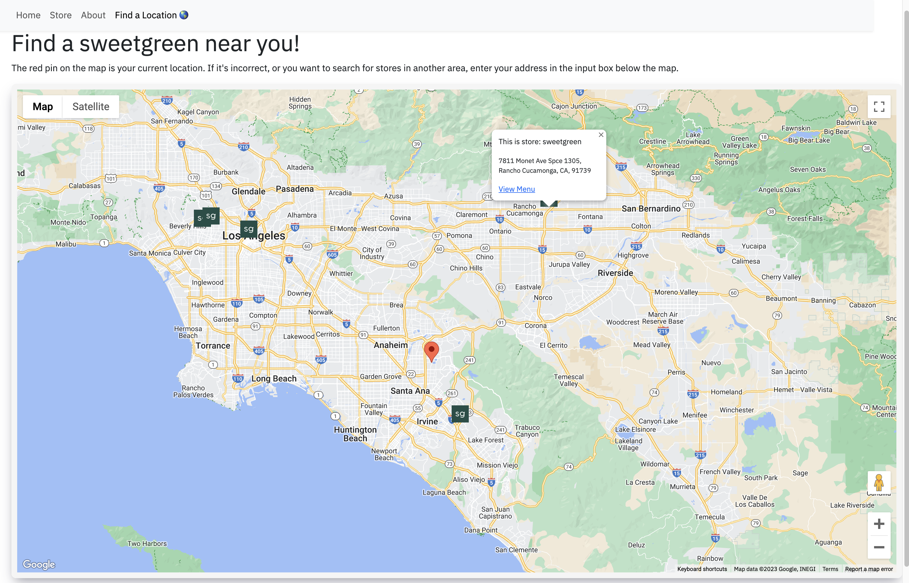
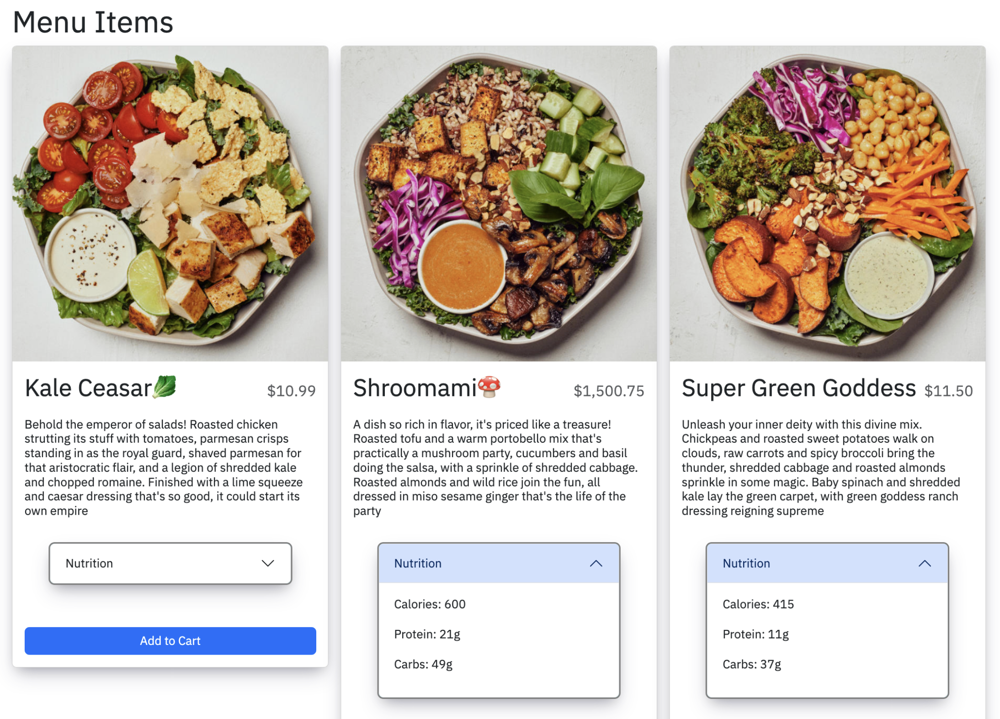
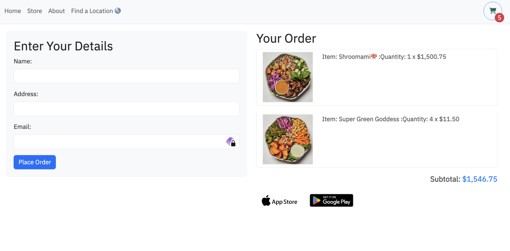

# Menu and Locations

This is a simple app that lets you view a menu and locations of a restaurant. Locations markers are displayed on a map using [@vis.gl/react-google-maps](https://visgl.github.io/react-google-maps/docs)

Clicking on the AdvancedMarker Component will display the location's name and address, as well as a link to that specific location's menu in an InfoWindow.



Items can be added to the cart where users can view their order and checkout. The items are fetched from a MongoDB collection by a Provider using React's Context API. Any other components that need access to these values can call React's Context hook. The cart is stored in local storage so that it persists on page refresh.


The checkout page will display the user's order and total.



## Getting Started

1. Clone the repo

```
https://github.com/kennysghub/melo.git
```

2. In order for this app to work properly, you will need to create a .env file in the client directory and server directory. The .env file in the client directory will need to contain a **Google Maps API key**. The .env file in the server directory will need to contain a **MongoDB URI**. There are .env.template files in both folders.

`./server/.env`

```
MONGO_URI=INSERT_MONGO_URI_HERE
```

`./client/.env`

```
GOOGLE_MAPS_API_KEY=INSERT_API_KEY_HERE

```

3. Install dependencies. In the root directory run:

```

npm run install-all

```

This will install the dependencies for the server and client subdirectories. Packages are separated to avoid unnecessary coupling.

3. Still in the root directory, run:

```

npm start

```

This will start the server and client concurrently. The server will run on port 3000 and the client will run on port 8080.
